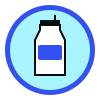
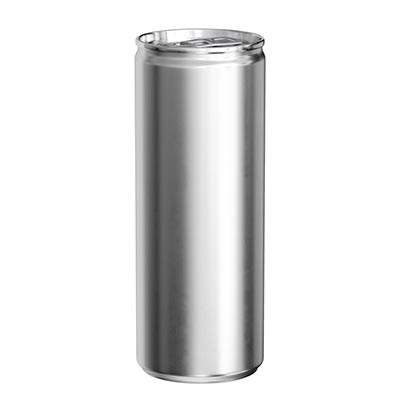
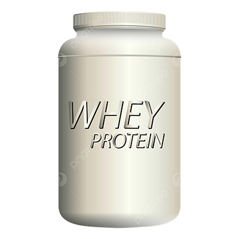
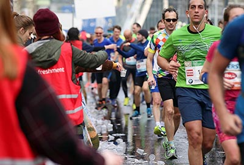
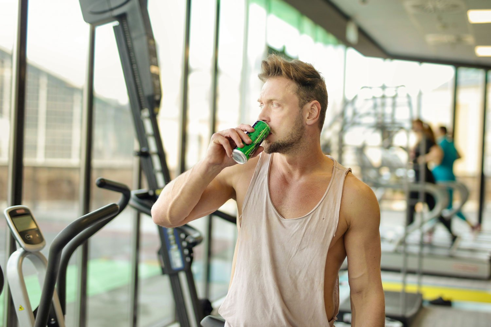

# about.html

```html
<!DOCTYPE html>
<html lang="en">
<head>
    <meta charset="UTF-8">
    <meta name="viewport" content="width=device-width, initial-scale=1.0">
    <meta name="author" content="Carter McCann">
    <meta name="description" content="Learn more about Pump Protein, the ultimate energy drink for body and mind.">
    <link rel="preconnect" href="https://fonts.googleapis.com">
    <link rel="preconnect" href="https://fonts.gstatic.com" crossorigin>
    <link href="https://fonts.googleapis.com/css2?family=Montserrat:ital,wght@0,100..900;1,100..900&family=Oxygen:wght@300;400;700&family=Playfair+Display:ital,wght@0,400..900;1,400..900&display=swap" rel="stylesheet">
    <title>Pump Protein - Home</title>
    <link rel="stylesheet" href="style.css">
    <!-- Favicon link -->
    <link rel="icon" href="favicon.ico" type="image/x-icon">
</head>
<body>
    <div class="container">
    <header class="header">
        
        <div class="header-content">
            <p>Welcome to <span>Pump Protein</span></p>
            <p><strong>Fueling the body</strong> and <em>the mind</em>.</p>
        </div>
    </header>

        <nav class="nav">
            <ul>
                <li><a href="index.html">Home</a></li>
                <li class="active"><a href="about.html">About</a></li>
                <li><a href="gallery.html">Gallery</a></li>
                <li><a href="contact.html">Contact</a></li>
            </ul>
        </nav>

        <main class="main">
            <div class="about-container">
                <div class="about-header">
                    <h1>About <span>Pump Protein</span></h1>
                    <p>Your trusted brand for peak performance drinks.</p>
                </div>
            
                <div class="about-mission">
                    <h2>Our Mission</h2>
                    <p>At Pump Protein, we aim to combine <strong>premium protein</strong> with cutting-edge science for unparalleled results.</p>
                </div>
            
                <div class="about-features">
                    <h2>Why Choose Us?</h2>
                    <p>Pump Protein is scientifically formulated to give you:</p>
                    <ul>
                        <li>Unmatched energy and focus</li>
                        <li>Muscle recovery support</li>
                        <li>Premium ingredients with proven results</li>
                    </ul>
                </div>
            
                <div class="about-values">
                    <h2>Our Promise</h2>
                    <p>We use only the finest ingredients to ensure our products deliver on their promise to fuel your body and mind.</p>
                    <ol>
                        <li>Quality you can trust</li>
                        <li>Transparency in every formula</li>
                        <li>Designed for peak performance</li>
                    </ol>
                </div>
            
                <div class="about-contact">
                    <h2>Contact Us</h2>
                    <address>
                        <strong>Email:</strong> support@pumpprotein.com<br>
                        <strong>Phone:</strong> <a href="tel:253-514-2771">253-514-2771</a>
                        <br>
                        <strong>Address:</strong><br>
                        311 Pump Protein Lane<br>
                        Pump Protein City, UT, 84660
                    </address>
                </div>
            </div>
            
        </main>

        <footer class="footer">
            <p>&copy; 2025 Pump Protein &#8226; Call us at <a href="tel:253-514-2771">253-514-2771</a></p>
        
        </footer>
    </div>
</body>
</html>

```

# contact.html

```html
<!DOCTYPE html>
<html lang="en">
<head>
    <meta charset="UTF-8">
    <meta name="viewport" content="width=device-width, initial-scale=1.0">
    <meta name="author" content="Carter McCann">
    <meta name="description" content="Learn more about Pump Protein, the ultimate energy drink for body and mind.">
    <link rel="preconnect" href="https://fonts.googleapis.com">
    <link rel="preconnect" href="https://fonts.gstatic.com" crossorigin>
    <link href="https://fonts.googleapis.com/css2?family=Montserrat:ital,wght@0,100..900;1,100..900&family=Oxygen:wght@300;400;700&family=Playfair+Display:ital,wght@0,400..900;1,400..900&display=swap" rel="stylesheet">
    <title>Pump Protein - Home</title>
    <link rel="stylesheet" href="style.css">
    <!-- Favicon link -->
    <link rel="icon" href="favicon.ico" type="image/x-icon">
</head>
<body>
    <div class="container">
    <header class="header">
        
        <div class="header-content">
            <p>Welcome to <span>Pump Protein</span></p>
            <p><strong>Fueling the body</strong> and <em>the mind</em>.</p>
        </div>
    </header>

        <nav class="nav">
            <ul>
                <li><a href="index.html">Home</a></li>
                <li><a href="about.html">About</a></li>
                <li><a href="gallery.html">Gallery</a></li>
                <li class="active"><a href="contact.html">Contact</a></li>
            </ul>
        </nav>

        <!-- Main Content / form stuff -->
        <main class="main">
            <h1>Reach Out to Us</h1>
            <p>Please fill out the form below so we can better understand your needs and goals with Pump Protein.</p>
            <form action="thanks.html" method="get">
                
                
                <fieldset>
                    <legend>Personal Information</legend>
                    
                    
                    <p>
                        <label for="fullname">Full Name:</label><br>
                        <input type="text" id="fullname" name="fullname" required 
                               placeholder="Chris Bumstead">
                    </p>

                    
                    <p>
                        <label for="email">Email Address:</label><br>
                        <input type="email" id="email" name="email" required 
                               placeholder="chris@example.com">
                    </p>

                    
                    <p>
                        <label for="phone">Phone Number:</label><br>
                        <input type="tel" id="phone" name="phone" 
                               placeholder="987-555-1234">
                    </p>
                </fieldset>

                
                <fieldset>
                    <legend>About Your Fitness Journey</legend>

                    
                    <p>
                        <span>What is your main fitness goal?</span><br>
                        <label>
                            <input type="radio" name="fitness_goal" value="muscle" required>
                            Build Muscle
                        </label><br>
                        <label>
                            <input type="radio" name="fitness_goal" value="endurance">
                            Increase Endurance
                        </label><br>
                        <label>
                            <input type="radio" name="fitness_goal" value="general_health">
                            General Health
                        </label>
                    </p>

                    
                    <p>
                        <span>What workouts do you enjoy?</span><br>
                        <label>
                            <input type="checkbox" name="workouts" value="lifting">
                            Weight Lifting
                        </label><br>
                        <label>
                            <input type="checkbox" name="workouts" value="running">
                            Running
                        </label><br>
                        <label>
                            <input type="checkbox" name="workouts" value="yoga">
                            Yoga
                        </label>
                    </p>
                </fieldset>

                
                <fieldset>
                    <legend>Your Pump Protein Experience</legend>

                    
                    <p>
                        <label for="favorite_flavor">What's your favorite Pump Protein flavor so far?</label><br>
                        <select id="favorite_flavor" name="favorite_flavor">
                            <option value="Orange Creamsicle" selected>Orange Creamsicle</option>
                            <option value="Lemonade">Lemonade</option>
                            <option value="berry">Berry Blast</option>
                        </select>
                    </p>

                    
                    <p>
                        <label for="comments">Additional Comments or Questions:</label><br>
                        <textarea id="comments" name="comments" rows="5" cols="30" 
                                  placeholder="Tell us about your experience or ask a question."></textarea>
                    </p>
                </fieldset>

                <!-- Submit Button -->
                <p>
                    <button type="submit" class="submit-btn">
                        Send Feedback
                    </button>
                </p>
            </form>
            <!-- end of the form -->

        </main>

        <!-- Footer -->
        <footer class="footer">
            <p>&copy; 2025 Pump Protein &bull; Call us at <a href="tel:253-514-2771">253-514-2771</a></p>
        </footer>

    </div> 
</body>
</html>

```

# favicon.ico

This is a binary file of the type: Binary

# gallery.html

```html
<!DOCTYPE html>
<html lang="en">
<head>
    <meta charset="UTF-8">
    <meta name="viewport" content="width=device-width, initial-scale=1.0">
    <meta name="author" content="Carter McCann">
    <meta name="description" content="Learn more about Pump Protein, the ultimate energy drink for body and mind.">
    <link rel="preconnect" href="https://fonts.googleapis.com">
    <link rel="preconnect" href="https://fonts.gstatic.com" crossorigin>
    <link href="https://fonts.googleapis.com/css2?family=Montserrat:ital,wght@0,100..900;1,100..900&family=Oxygen:wght@300;400;700&family=Playfair+Display:ital,wght@0,400..900;1,400..900&display=swap" rel="stylesheet">
    <title>Pump Protein - Home</title>
    <link rel="stylesheet" href="style.css">
    <!-- Favicon link -->
    <link rel="icon" href="favicon.ico" type="image/x-icon">
</head>
<body>
    <div class="container">
    <header class="header">
        
        <div class="header-content">
            <p>Welcome to <span>Pump Protein</span></p>
            <p><strong>Fueling the body</strong> and <em>the mind</em>.</p>
        </div>
    </header>

        <nav class="nav">
            <ul>
                <li><a href="index.html">Home</a></li>
                <li><a href="about.html">About</a></li>
                <li class="active"><a href="gallery.html">Gallery</a></li>
                <li><a href="contact.html">Contact</a></li>
            </ul>
        </nav>


    <main class="gallery">
        <h1>Product Gallery</h1>
        <div class="gallery-container">
            <figure>
                
                <figcaption>Pump Protein Drink</figcaption>
            </figure>
            <figure>
                
                <figcaption>type of Protein</figcaption>
            </figure>
            <figure>
                
                <figcaption>Gym Athlete with Pump Protein</figcaption>
            </figure>
            <figure>
                
                <figcaption>Runners with Pump Protein</figcaption>
            </figure>
            <figure>
                
                <figcaption>Energy Boost with Pump Protein</figcaption>
            </figure>
            <figure>
                
                <figcaption>Crossfit with Pump Protein</figcaption>
            </figure>
            <figure>
                
                <figcaption>lifing pump</figcaption>
            </figure>
            <figure>
                
                <figcaption>Refreshing Pump Protein Drink</figcaption>
            </figure>
        </div>
    </main>

    <footer class="footer">
        <p>&copy; 2025 Pump Protein &bull; Call us at <a href="tel:253-514-2771">253-514-2771</a></p>
    </footer>
</body>
</html>

```

# images\arnoldgym.webp

This is a binary file of the type: Image

# images\arnoldpump.png

This is a binary file of the type: Image

# images\athlete.webp

This is a binary file of the type: Image

# images\bodybuilder.webp

This is a binary file of the type: Image

# images\crossfit.png

This is a binary file of the type: Image

# images\hero.jpg

This is a binary file of the type: Image

# images\hero.webp

This is a binary file of the type: Image

# images\image1.jpg

This is a binary file of the type: Image

# images\pump-protein-logo.png

This is a binary file of the type: Image

# images\runners.jpg

This is a binary file of the type: Image

# images\whey.png

This is a binary file of the type: Image

# index.html

```html
<!DOCTYPE html>
<html lang="en">
<head>
    <meta charset="UTF-8">
    <meta name="viewport" content="width=device-width, initial-scale=1.0">
    <meta name="author" content="Carter McCann">
    <meta name="description" content="Learn more about Pump Protein, the ultimate energy drink for body and mind.">
    <link rel="preconnect" href="https://fonts.googleapis.com">
    <link rel="preconnect" href="https://fonts.gstatic.com" crossorigin>
    <link href="https://fonts.googleapis.com/css2?family=Montserrat:ital,wght@0,100..900;1,100..900&family=Oxygen:wght@300;400;700&family=Playfair+Display:ital,wght@0,400..900;1,400..900&display=swap" rel="stylesheet">
    <title>Pump Protein - Home</title>
    <link rel="stylesheet" href="style.css">
    <!-- Favicon link -->
    <link rel="icon" href="favicon.ico" type="image/x-icon">
</head>
<body>
    <div class="container">
    <header class="header">
        
        <div class="header-content">
            <p>Welcome to <span>Pump Protein</span></p>
            <p><strong>Fueling the body</strong> and <em>the mind</em>.</p>
        </div>
    </header>
    
    <!-- Navigation -->
    <nav class="nav">
        <ul>
            <li class="active"><a href="index.html">Home</a></li>
            <li><a href="about.html">About</a></li>
            <li><a href="gallery.html">Gallery</a></li>
            <li><a href="contact.html">Contact</a></li>
        </ul>
    </nav>
  
    <!-- Main -->
    <main class="main">
        <h1>Home</h1>
        <div class="hero-wrapper">
            
        </div>

        <div class="hero">
            <div class="hero-text">
                <h2>Fuel Your Performance</h2>
                <h3>With 30g of protein and premium nootropics.</h3>
            </div>
            <figure class="hero-image">
                <figcaption>Stay energized with Pump Protein</figcaption>
            </figure>
        </div>

        <section class="content">
            <h2>Fuel Your Performance</h2>
            <p>With 30g of protein and premium nootropics, our formula is designed to optimize both body and mind.</p>
        </section>

        <!-- Gradient Section -->
        <section class="gradient-section">
            <h2>Premium Quality</h2>
            <p>Experience the difference with scientifically formulated ingredients that work together to maximize your performance.</p>
        </section>

        <section class="features">
            <h2>Our Ingredients</h2>
            <dl>
                <dt>30g of Protein</dt>
                <dd>Muscle-fueling power to support your fitness goals.</dd>
                <dt>300mg Alpha-GPC</dt>
                <dd>Enhances cognitive function for focus and clarity.</dd>
                <dt>1500mg L-Carnitine</dt>
                <dd>Boosts energy production and fat metabolism.</dd>
            </dl>
        </section>

        <h2>Get Started</h2>
        <p>Click <a href="about.html">here</a> to learn more about us!</p>

        <div class="quick-links">
            <h2>Quick Links</h2>
            <p>Need gym equipment? Check out these resources:</p>
            <ul>
                <li><a href="https://www.roguefitness.com" target="_blank">Rogue Fitness</a></li>
                <li><a href="https://www.myprotein.com" target="_blank">MyProtein</a></li>
            </ul>
        </div>            
    </main>

    <!-- Footer -->
    <footer class="footer">
        <p>&copy; 2025 Pump Protein &bull; Call us at <a href="tel:253-514-2771">253-514-2771</a></p>
    </footer>
</div>
</body>
</html>
```

# style.css

```css
/*  border-box */
*, *::before, *::after {
    box-sizing: border-box;
}

body {
    margin: 0;
    padding: 0;
    font-family: 'Montserrat', sans-serif; 
    font-size: 16px; 
    line-height: 1.5;
    background-color: #D9D9D9;
    color: #010F0C;            
}

p {
    font-size: 1.125rem; 
    margin-bottom: 1rem;
}

/* Header */
h1 {
    color: #3351F1;   
    font-weight: 700; 
    font-size: 2rem; 
    margin: 1rem 0;
    text-align: center;
}

h2 {
    color: #010F0C;   
    font-weight: 700; 
    font-size: 1.5rem; 
    margin-top: 1.5rem;
    margin-bottom: 0.5rem;
}

/* Width Control & Center Page Contents */
header, nav, main, footer, .container {
    max-width: 1200px;
    margin-left: auto;
    margin-right: auto;
}

/* General Layout */
.container {
    background-color: #D9D9D9; 
    border: 2px solid #3351F1; 
    border-radius: 1px;        
    padding: 1rem;
}

/* Site logo and header styling */
.header {
    background-color: #3351F1; 
    color: #FFFFFF;           
    padding: 1rem;
    text-align: center;
    display: flex;
    align-items: center;
    justify-content: center;
}

.logo {
    max-width: 100px;
    max-height: 100px;
    margin-right: 1rem;
}

.header-content {
    display: flex;
    flex-direction: column;
}

.footer {
    background-color: #010F0C; 
    color: #FFFFFF;            
    text-align: center;
    padding: 1rem;
    clear: both;
}

footer a {
    color: #FFFFFF;  
    text-decoration: none;          
}

footer a:hover {
    color: #A8F4FF; 
    text-decoration: none;           
}

/* Navigation / Media Queries */
@media only screen and (max-width: 600px) {
    
        .nav ul {
            list-style: none;   
            margin: 0;
            padding: 0;
            display: flex;
            flex-direction: column;
            background-color: #3351F1;
        }

        .nav li {
            margin-bottom: 0.5rem;
        }

        .nav li a {
            text-decoration: none;    
            color: #FFFFFF;          
            display: block;
            padding: 0.5rem 1rem;
            line-height: 48px;        
            font-weight: 400;
            transition: background-color 0.3s;
        }

        .nav li.active a {
            background-color: #A8F4FF; 
            color: #010F0C;           
        }

        .nav li a:hover {
            background-color: #A8F4FF; 
            color: #010F0C;          
        }

}

/* Tablet and desktop styles - horizontal menu */
@media only screen and (min-width: 601px) {
    .nav ul {
        list-style: none;   
        margin: 0;
        padding: 0;
        display: flex;      
        justify-content: center;
        gap: 1rem;
        background-color: #3351F1; 
    }
    
    .nav li a {
        text-decoration: none;    
        color: #FFFFFF;          
        display: inline-block;
        padding: 0.5rem 1rem;
        line-height: 48px;        
        font-weight: 400;
        transition: background-color 0.3s;
    }
    
    .nav li.active a {
        background-color: #A8F4FF; 
        color: #010F0C;           
    }
    
    .nav li a:hover {
        background-color: #A8F4FF; 
        color: #010F0C;          
    }
}

/* Hero  */
.hero-wrapper {
    width: 100%;
    margin: 0;
    overflow: hidden;
    max-width: 100%; 
}

.hero-wrapper img {
    width: 100%;
    height: auto;
}

.hero {
    display: flex;
    align-items: center;
    justify-content: space-around;
    flex-wrap: wrap;
    background-color: #D9D9D9; 
    padding: 1rem;
    border: 2px solid #3351F1; 
    border-radius: 8px;
    background: linear-gradient(to bottom, #D9D9D9, #A8F4FF);
}

.hero img {
    max-width: 40%;  
    height: auto;
    float: right;    
    margin-left: 1rem;  
}

/* Lists */
main ul, .main ul {
    list-style-type: circle; 
    margin-left: 1.5rem; 
    padding: 0.5rem;
}

main ol, .main ol {
    list-style-type: decimal; 
    margin-left: 1.5rem;
    padding: 0.5rem;
}

/* style for <dl> */
dl {
    margin: 1rem;
}

dt {
    font-weight: 700; 
    color: #3351F1;
    margin-top: 1rem;
}

dd {
    margin: 0 0 1rem 1rem;
    color: #010F0C;
}

main a:hover {
    color: #3351F1; 
    text-decoration: underline;
}

strong {
    font-weight: 700; 
    color: #010F0C;
}

address {
    font-style: normal;
    background-color: #A8F4FF; 
    padding: 1rem;
    border-radius: 4px;
}

/* Gallery stuff here */
.gallery {
    text-align: center;
    padding: 1rem;
}

.gallery-container {
    display: flex;
    flex-wrap: wrap;
    justify-content: center;
    gap: 1rem;
}

.gallery-container figure {
    background: #fff;
    border: 2px solid #3351F1;
    border-radius: 8px;
    padding: 1rem;
    width: 320px;
    text-align: center;
    transition: box-shadow 0.3s ease;
}

/* shadow for gallery images */
.gallery-container figure:hover {
    box-shadow: 0 8px 15px rgba(0, 0, 0, 0.3);
}

.gallery-container img {
    max-width: 100%;
    height: auto;
    border-radius: 5px;
}

.gallery-container figcaption {
    margin-top: 0.5rem;
    color: #010F0C;
}

/* Form layout and styling */
form fieldset {
    border: 2px solid #3351F1;  
    border-radius: 8px;
    margin: 1rem 0;
    padding: 1rem;
    background-color: #fff;     
}

form legend {
    color: #010F0C;
    font-weight: 700;
    font-size: 1.2rem;
    padding: 0.2rem 0.5rem;
}

form p {
    margin-bottom: 1rem;
}

form label {
    font-weight: 600;
    cursor: pointer;  
}

form input[type="text"], form input[type="email"], form input[type="tel"], form select, form textarea {
    width: 100%;
    max-width: 400px;   
    padding: 0.5rem;
    border: 2px solid #3351F1;
    border-radius: 5px;
    font-family: 'Montserrat', sans-serif;
    background-color: #A8F4FF; 
}

form input[type="radio"], form input[type="checkbox"] {
    margin-right: 0.3rem;
    accent-color: #3351F1; 
}

form textarea {
    resize: vertical; 
}

form .submit-btn {
    background-color: #3351F1;
    color: #fff;
    border: 2px solid #010F0C;
    border-radius: 8px;
    padding: 0.5rem 1rem;
    cursor: pointer;
    font-weight: 700;
}

form .submit-btn:hover {
    background-color: #A8F4FF;
    color: #010F0C;
}

/* Thanks page */
.message {
    border: 2px solid #3351F1;
    display: inline-block;
    padding: 2rem;
    border-radius: 8px;
    background: #fff;
    margin: 2rem auto;
}

/* Gradient sections */
.gradient-section {
    background: linear-gradient(to right, #3351F1, #A8F4FF);
    padding: 2rem;
    color: #FFFFFF;
    border-radius: 8px;
    margin: 1.5rem 0;
}
```

# thanks.html

```html
<!DOCTYPE html>
<html lang="en">
<head>
    <!-- head section-->
    <meta charset="UTF-8">
    <meta name="viewport" content="width=device-width, initial-scale=1.0">
    <meta name="author" content="Carter McCann">
    <meta name="description" content="About Pump Protein">
    <meta http-equiv="refresh" content="5; url=index.html">
    <link rel="preconnect" href="https://fonts.googleapis.com">
    <link rel="preconnect" href="https://fonts.gstatic.com" crossorigin>
    <link href="https://fonts.googleapis.com/css2?family=Montserrat:ital,wght@0,100..900;1,100..900&family=Oxygen:wght@300;400;700&family=Playfair+Display:ital,wght@0,400..900;1,400..900&display=swap" rel="stylesheet">    <title>Pump Protein - About</title>
    <link rel="stylesheet" href="style.css">

</head>
<body>
    <!-- body sections-->
    <div class="container">
        <header class="header">
           <p> Gallery of <span>Pump Protein</span></p>
            <p>Your trusted brand for peak performance drinks.</p>
        </header>

        <nav class="nav">
            <ul>
                <li><a href="index.html">Home</a></li>
                <li><a href="about.html">About</a></li>
                <li class="active"><a href="gallery.html">Gallery</a></li>
                <li><a href="contact.html">Contact</a></li>
            </ul>
        </nav>
    <div class="message">
        <h1>Thank You!</h1>
        <p>Your information has been received. We appreciate your feedback!</p>
        <p>You will be redirected to the home page in 5 seconds.</p>
    </div>
    <footer class="footer">
        <p>&copy; 2025 Pump Protein &bull; Call us at <a href="tel:253-514-2771">253-514-2771</a></p>
    </footer>
</body>
</html>

```

